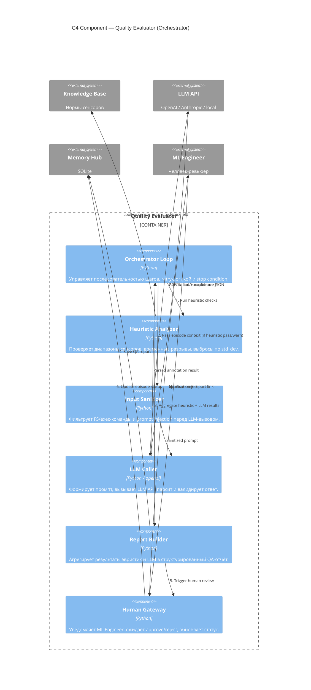

# C4 Component — Quality Evaluator

Показывает внутреннее устройство ядра системы: компоненты оркестратора и их взаимодействие.



## Ответственность компонентов

| Компонент | Что делает | Чего не делает |
|-----------|-----------|----------------|
| Orchestrator Loop | Управляет шагами, retry, timeout | Не пишет данные напрямую |
| Heuristic Analyzer | Threshold-проверки, outlier detection | Не вызывает LLM |
| Input Sanitizer | Блок-лист команд, escape | Не изменяет смысл данных |
| LLM Caller | Формирует промпт, парсит ответ | Не выполняет function calling |
| Report Builder | Структурирует отчёт | Не принимает решения, только агрегирует |
| Human Gateway | Уведомление, ожидание approval | Не auto-approve |

## Стратегия fallback

```
Heuristic OK → LLM Caller
                ├── success → Report с LLM annotation
                └── error / timeout → Report с heuristic-only
                                      (флаг: LLM_UNAVAILABLE)
```
