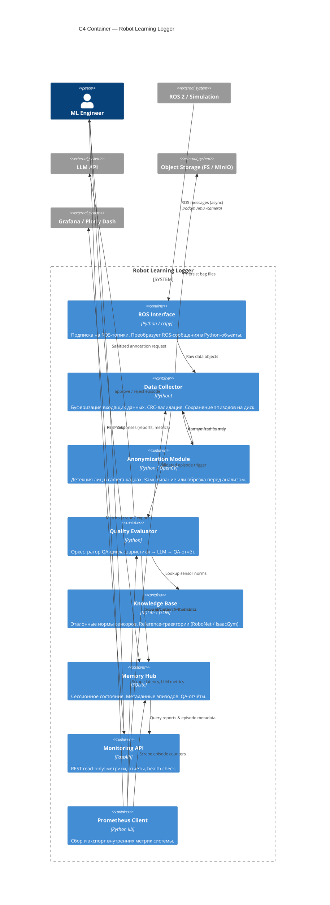

# C4 Container — Robot Learning Logger

Показывает контейнеры внутри системы: процессы, хранилища, их ответственность и взаимодействие.

## Ответственность контейнеров

| Контейнер | Читает | Пишет |
|-----------|--------|-------|
| ROS Interface | ROS topics | In-memory buffer |
| Data Collector | ROS Interface buffer | Local FS / MinIO, Memory Hub (metadata) |
| Anonymization Module | Camera frames | Anonymized frames (in-memory) |
| Quality Evaluator | Knowledge Base, LLM API | Memory Hub (reports) |
| Knowledge Base | JSON / SQLite (static) | — |
| Memory Hub | — | SQLite (episodes, reports) |
| Monitoring API | Memory Hub | — |
| Prometheus Client | Internal counters | Metrics endpoint |
