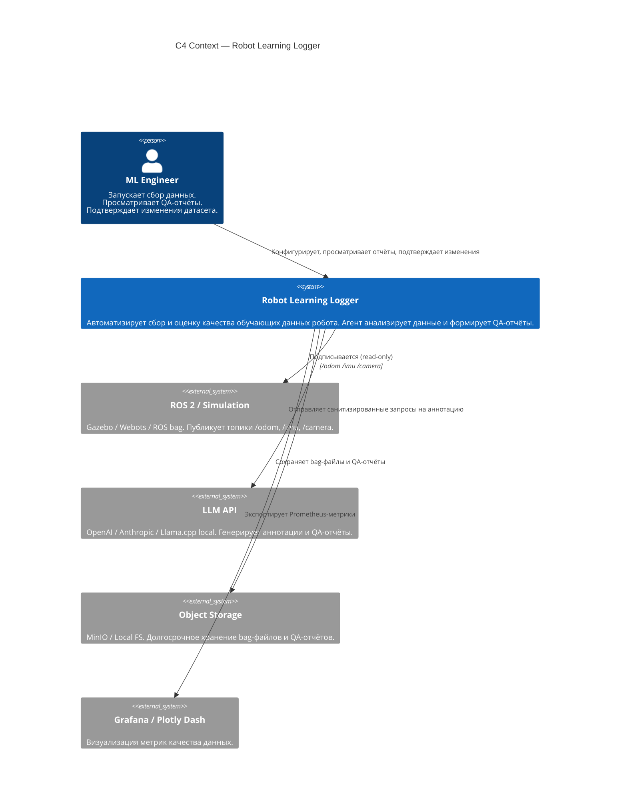

# C4 Context — Robot Learning Logger

Показывает систему в целом: пользователи, внешние сервисы и границы.

## Границы

| Граница | Описание |
|---------|---------|
| Система | Robot Learning Logger — всё, что запускается локально |
| Пользователь | Один ML Engineer на PoC; роль: оператор и ревьюер |
| Внешние сервисы | ROS (симулятор), LLM API, хранилище, дашборд |
| Не входит в PoC | Реальный робот, облачное хранение, внешний CI/CD |
