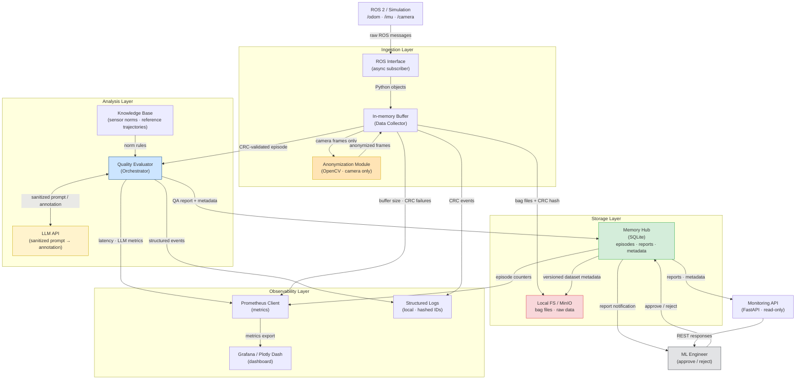

# Data Flow Diagram — Robot Learning Logger

Показывает, как данные проходят через систему: что хранится, что логируется, что никогда не покидает sandbox.

## Что хранится и где

| Данные | Хранилище | Формат | Содержит PII? |
|--------|-----------|--------|---------------|
| Bag-файлы эпизодов | Local FS / MinIO | Binary / ROS bag | Нет (после анонимизации) |
| CRC-хэши файлов | SQLite `episodes` | TEXT | Нет |
| QA-отчёты | SQLite `reports` + JSON | JSON | Нет |
| Метаданные эпизодов | SQLite `episodes` | Табличные | Нет |
| Нормы сенсоров | SQLite / JSON | JSON | Нет |
| Prometheus-метрики | In-memory / endpoint | Text (OpenMetrics) | Нет |
| Структурированные логи | Local FS | JSON lines | ID хэшированы |

## Что никогда не покидает sandbox

- Сырые camera-кадры до анонимизации — не передаются в LLM, не логируются.
- Идентификаторы пользователей — хэшируются SHA-256 перед сохранением.
- API-ключи — только в `.env`; не логируются, не попадают в отчёты.
- Данные эпизодов — не уходят в публичное облако в PoC.

## Что логируется

| Событие | Уровень | Содержимое |
|---------|---------|-----------|
| Старт/стоп сессии | INFO | session_id (хэш), timestamp |
| Получение эпизода | INFO | episode_id, topics, duration |
| CRC fail | WARNING | episode_id, retry count |
| Результат QA | INFO | episode_id, status, quality_score |
| LLM fallback | WARNING | episode_id, reason |
| Prompt injection detected | ERROR | sanitizer rule matched (без payload) |
| Disk quota warning | WARNING | current_usage_gb |
