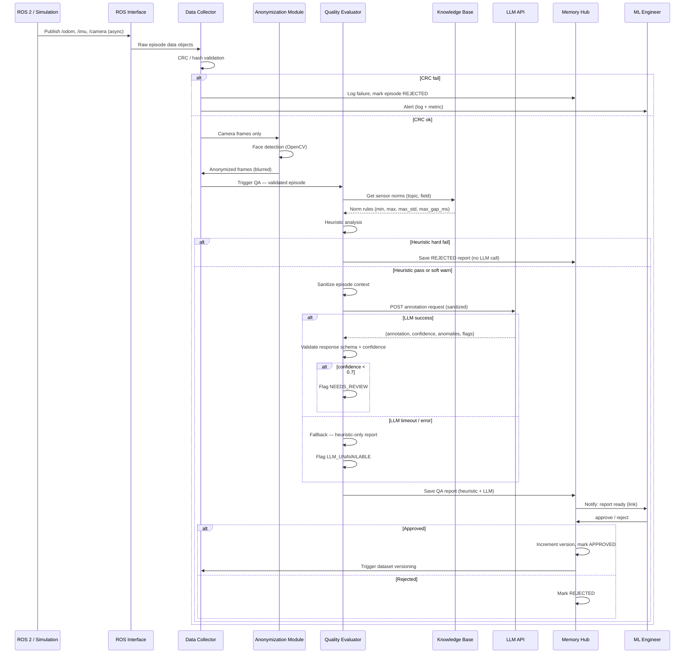

# Workflow Diagram — Robot Learning Logger

Пошаговое выполнение запроса, включая ветки ошибок.



## Состояния эпизода

```
PENDING → (CRC fail)    → REJECTED
PENDING → (heuristic hard fail) → REJECTED
PENDING → (QA complete, human)  → APPROVED
PENDING → (low confidence / LLM unavailable) → NEEDS_REVIEW
NEEDS_REVIEW → (human decision) → APPROVED | REJECTED
```

## Ветки ошибок

| Ветка | Триггер | Результат |
|-------|---------|-----------|
| CRC fail | Hash mismatch при записи | REJECTED, retry × 1, alert |
| ROS disconnect | Heartbeat timeout 5 с | Retry × 3; буфер сохраняется на диск |
| LLM timeout | >30 с без ответа | Fallback: heuristic-only; flag LLM_UNAVAILABLE |
| LLM rate limit | HTTP 429 | Exponential backoff 1→2→4 с |
| Low confidence | `confidence < 0.7` | Flag NEEDS_REVIEW; manual review required |
| Human timeout | Нет ответа за 24 ч | Автоматически → NEEDS_REVIEW |
